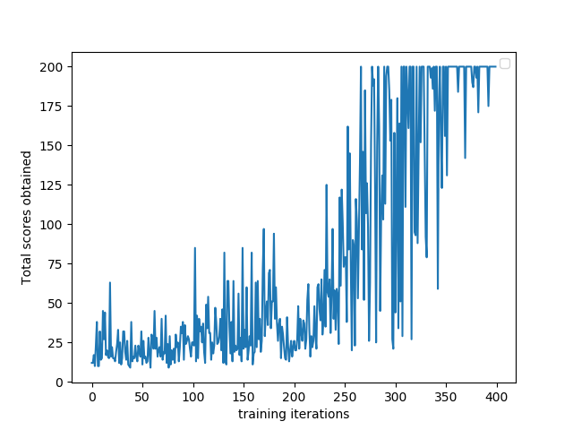
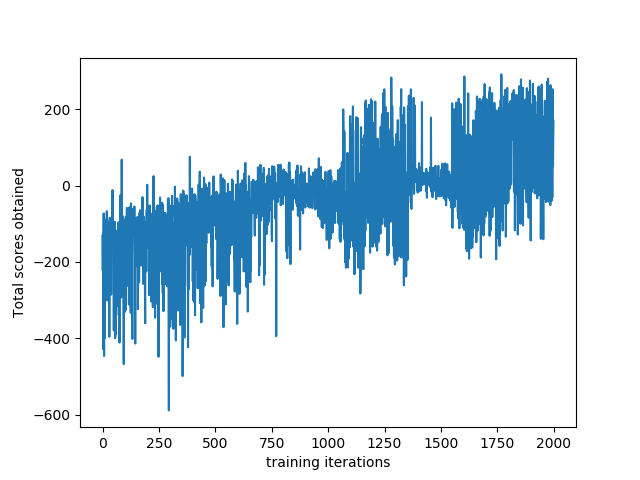

# REINFORCE

REINFORCE is a vanilla policy gradient approach towards RL problems. This algorithm is implemented succesfully on the followoing problem from OpenAi gym

### Results:

#### CartPole-v0

#### LunarLander-v2

### Observations:
This method theoretically seems to work in expectation terms, but for individual trials occasionally gives sub-optimal results.The new data generated depends upon previous policy and hence this technique cannot be used in high stake situations.

### dependencies:

* [openai gym](https://gym.openai.com/)           
* [pytorch](https://pytorch.org/)

